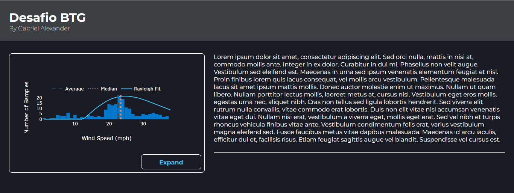
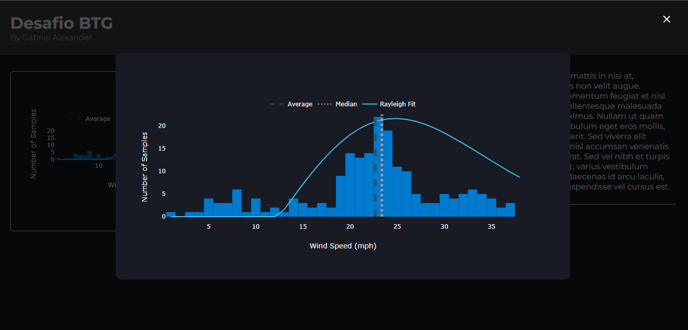

<h1 align="center">
Desafio BTG versão NextJS
By Gabriel Alexander
</h1>

<a href="#about">About</a> •
<a href="#features">Features</a> •
<a href="#layout">Layout</a> •
<a href="#techs">Techs</a> •
<a href="#author">Author</a> •
<a href="#license">License</a>

## About

🚀 Desafio BTG (v NextJs) é uma aplicação feita para mostrar a possibilidade de redimensionar gráficos construidos com a biblioteca [ploty.js](https://github.com/plotly/react-plotly.js/).

## Features

- [x]  Renderizar gráficos do plotly
- [x]  Redimensionar gráficos do plotly

## Layout

## How it works

> ### instalar dependencias
> yarn 
> 
> #or
> 
> npm i

> ### iniciar o projeto
> yarn dev
>
> #or
>
> npm run dev
> 
> 
> Abra [http://localhost:3000](http://localhost:3000/) no seu navegador e veja o resultado.
> 

## Techs

As seguintes tecnologias foram utilizadas no desenvolvimento do projeto:

- [React](https://reactjs.org/)
- [NextJS](https://nextjs.org/)
- [Axios](https://github.com/axios/axios)
- [Plotlyjs](https://plotly.com/javascript/react/)
- [React-icons](https://react-icons.github.io/react-icons/)

## Author

<a href="[https://www.linkedin.com/in/gabriel-alexander-abb90a1b6/](https://www.linkedin.com/in/gabriel-alexander-abb90a1b6/)" >

 
<b>Gabriel Alexander</b></a>
 

## License

This project is under the license [MIT](https://www.notion.so/LICENSE).
